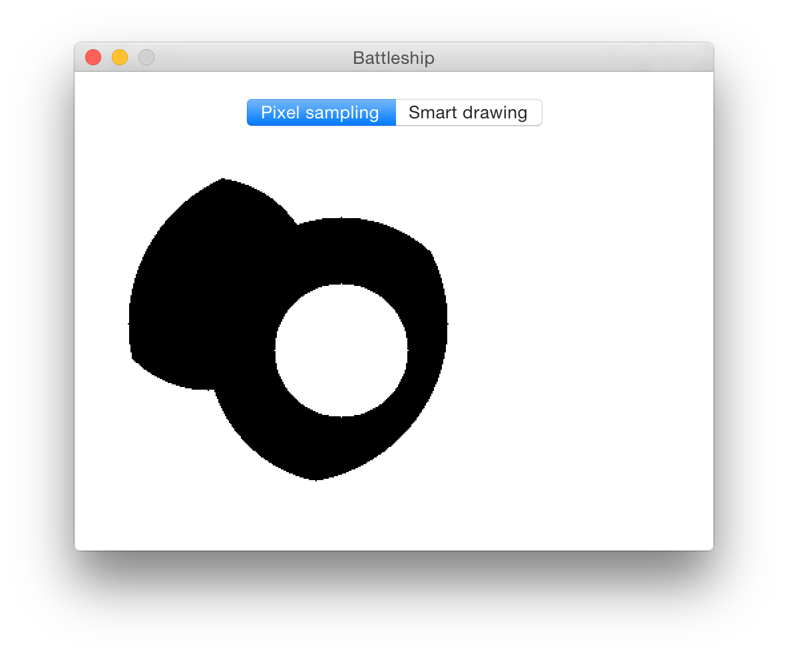
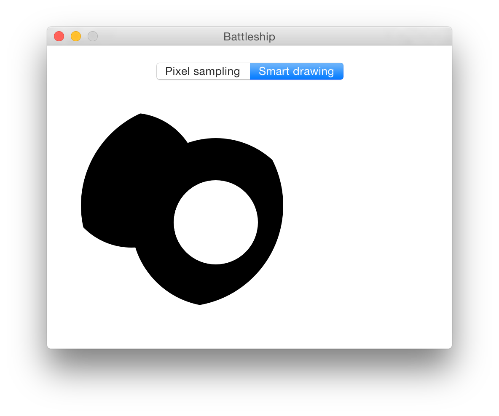

# Battleship

My take on [_Functional Programming in Swift's_][fpswift] Battleship example, using structs, Swift 2 protocol extensions and Core Graphics to render regions in a nicer way.

[fpswift]: http://www.objc.io/books/

Here's the code:

```swift
let circle1 = Circle(100).offset(200, 150)
let circle2 = Circle(80).offset(100, 200)
let enclosing = Circle(120).offset(160, 170)
let circle4 = Circle(50).offset(200, 150)
visualizer.region = circle1.plus(circle2).intersection(enclosing).minus(circle4)
```

Results (in pixel sampling and smart drawing modes):




The main difference with the book's example is that instead of dealing with `CGPoint -> Bool` matcher functions directly, I wrap them in a structs (conforming to a `RegionType` protocol). There are two nice things about this:

- you can use the more readable, nicely chainable method notation to transform regions
- in addition to the matcher function, a struct can also hold more information about the nature of the region

The second point means that `Circle` stores its radius, and `.offset`, `.plus`, `.intersection`, `.minus` return their own transformation structs that wrap the original regions and hold information about the transformation. This way, we can compose actual regions and draw them really nicely using Core Graphics.
